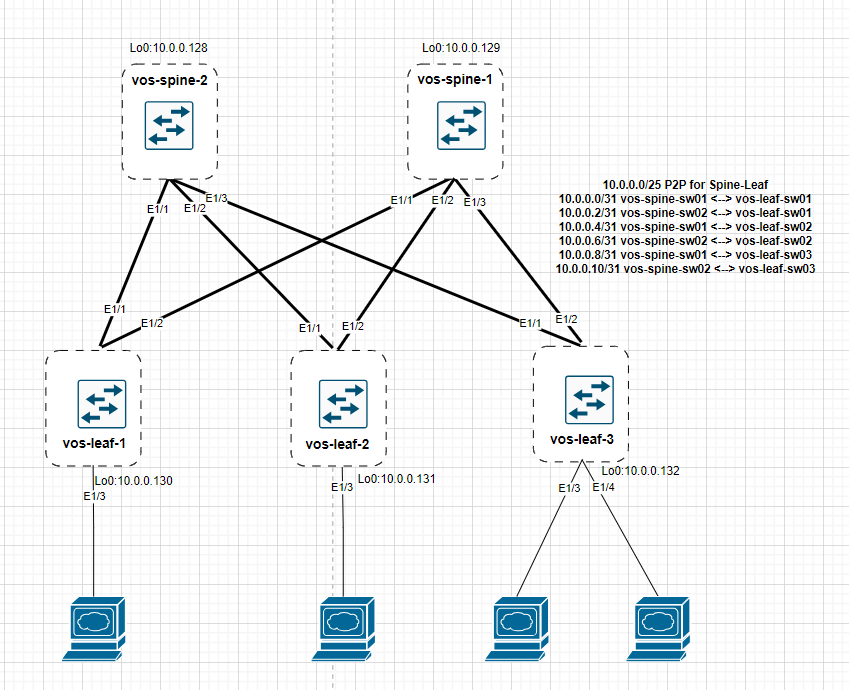

# Лабораторная работа №4. Построение Underlay. BGP
Задачи:
1. Настроить BGP в Underlay сети, для IP связанности между всеми сетевыми устройствами (+ выбрать iBGP или eBGP)
2. Обеспечить доступность Loopback всех устройств
3. Зафиксировать в документации план работ, адресное пространство, схему сети, настройки
### Схема сети
Схема не изменена по сравнению с предыдущей работой.

### Адресация сети
Для loopback в лаборатной работе №1 была выделена сеть 10.0.0.128/25
|Address|Description|
|---|---|
|10.0.0.128/32| loopback vos-spine-sw01
|10.0.0.129/32| loopback vos-spine-sw02
|10.0.0.130/32| loopback vos-leaf-sw01
|10.0.0.131/32| loopback vos-leaf-sw02
|10.0.0.132/32| loopback vos-leaf-sw03
### Конфигурация
> Изначальная конфигурация взята из лабораторной работы №1. Добавлены и настроены loopback
#### Настройка iBGP
Выберем для настройки iBGP, прост в плане конфигурации, ну и зачем усложнять underlay маршрутизацию.
Общие параметры настройки:
- номер автономной системы: 65000 (из пула приватных)
- vos-spine-sw01 и vos-spine-sw02 будут Route Reflector'ами
- router-id = ip address loopback

**Создание route-map**
На каждом оборудовании создадим prefix-list с сетью 10.0.0.128/26 (сеть, содержащая loopback-адреса). Затем привяжем его к route-map, который будет использовать при настройке iBGP-сессии.
Данная настройка необходима для защиты анонсирования маршрутов.
Конфигурация на всем оборудовании одинакова:
```
ip prefix-list iBGP_Underlay_connected seq 5 permit 10.0.0.128/25 le 32

route-map iBGP_Underlay_connected permit 10
  match ip address prefix-list iBGP_Underlay_connected 
route-map iBGP_Underlay_connected deny 100
```
**Настройка со стороны SPINE**
Настроим три iBGP сессии между каждым Spine и Leaf. Начнем со стороны Spine. Так как для всех трех соседей настройки одинаковы, воспользуемся template peer.
Комментарии:
- таймеры keepalive, hold установим в рекомендуемые
- указываем, что все LEAF - это клиенты
- указываем, что необходимо менять next-hop при передаче маршрутов. Иначе LEAF будут отвергать маршруты с loopback-адресами других LEAF из-за отсутствия next-hop в таблице
- делаем редистрибьюцию connected сетей (в нашем случае loopback) и прикрепляем созданный ранее route-map

Конфигурация на vos-spine-sw01 (на втором аналогично):
```
router bgp 65000
  router-id 10.0.0.128
  log-neighbor-changes
  address-family ipv4 unicast
    redistribute direct route-map iBGP_Underlay_connected
  template peer iBGP_IPv4_Unicast_RR_client
    remote-as 65000
    timers 3 9
    address-family ipv4 unicast
      route-reflector-client
      route-map iBGP_Underlay_connected in
      route-map iBGP_Underlay_connected out
      next-hop-self all
  neighbor 10.0.0.1
    inherit peer iBGP_IPv4_Unicast_RR_client
    description vos-leaf-sw01
  neighbor 10.0.0.5
    inherit peer iBGP_IPv4_Unicast_RR_client
    description vos-leaf-sw02
  neighbor 10.0.0.9
    inherit peer iBGP_IPv4_Unicast_RR_client
    description vos-leaf-sw03
```
**Настройка со стороны LEAF**
На каждом LEAF необходимо настроить по две iBGP сессии со SPINE.
Комментарии:
- таймеры keepalive, hold установим в рекомендуемые
- настройка maximum-paths включает возможность балансировки. Без нее loopback был бы доступен только через один spine (лучший маршрут был бы 1)
- делаем редистрибьюцию connected сетей (в нашем случае loopback) и прикрепляем созданный ранее route-map

Конфигурация на vos-leaf-sw01 (на втором и третьем аналогично):
```
router bgp 65000
  router-id 10.0.0.130
  log-neighbor-changes
  address-family ipv4 unicast
    redistribute direct route-map iBGP_Underlay_connected
    maximum-paths ibgp 64
  template peer iBGP_IPv4_Unicast
    remote-as 65000
    timers 3 9
    address-family ipv4 unicast
      route-map iBGP_Underlay_connected in
      route-map iBGP_Underlay_connected out
  neighbor 10.0.0.0
    inherit peer iBGP_IPv4_Unicast
    description vos-spine-sw01
  neighbor 10.0.0.2
    inherit peer iBGP_IPv4_Unicast
    description vos-spine-sw02
```
### Проверка работы
С каждого SPINE установились соседства с каждым LEAF:
```
vos-spine-sw01# show ip bgp summary 
BGP summary information for VRF default, address family IPv4 Unicast
BGP router identifier 10.0.0.128, local AS number 65000
BGP table version is 42, IPv4 Unicast config peers 3, capable peers 3
4 network entries and 4 paths using 976 bytes of memory
BGP attribute entries [2/344], BGP AS path entries [0/0]
BGP community entries [0/0], BGP clusterlist entries [0/0]

Neighbor        V    AS MsgRcvd MsgSent   TblVer  InQ OutQ Up/Down  State/PfxRcd
10.0.0.1       4 65000     310     309       42    0    0 00:15:17 1         
10.0.0.5       4 65000     893     896       42    0    0 00:16:18 1         
10.0.0.9       4 65000     874     878       42    0    0 00:16:18 1 

vos-spine-sw02# show ip bgp summary 
BGP summary information for VRF default, address family IPv4 Unicast
BGP router identifier 10.0.0.129, local AS number 65000
BGP table version is 18, IPv4 Unicast config peers 3, capable peers 3
4 network entries and 4 paths using 976 bytes of memory
BGP attribute entries [2/344], BGP AS path entries [0/0]
BGP community entries [0/0], BGP clusterlist entries [0/0]

Neighbor        V    AS MsgRcvd MsgSent   TblVer  InQ OutQ Up/Down  State/PfxRcd
10.0.0.3       4 65000     955     981       18    0    0 00:14:22 1         
10.0.0.7       4 65000     896     898       18    0    0 00:14:21 1         
10.0.0.11      4 65000     876     880       18    0    0 00:14:22 1 
```
У каждого LEAF появились маршруты до всех loopback-ов. При этом до loopback-ов LEAFs работает балансировка:
```
vos-leaf-sw01# show ip route BGP
IP Route Table for VRF "default"
'*' denotes best ucast next-hop
'**' denotes best mcast next-hop
'[x/y]' denotes [preference/metric]
'%<string>' in via output denotes VRF <string>

10.0.0.128/32, ubest/mbest: 1/0
    *via 10.0.0.0, [200/0], 00:13:08, bgp-65000, internal, tag 65000
10.0.0.129/32, ubest/mbest: 1/0
    *via 10.0.0.2, [200/0], 00:13:08, bgp-65000, internal, tag 65000
10.0.0.131/32, ubest/mbest: 2/0
    *via 10.0.0.0, [200/0], 00:13:08, bgp-65000, internal, tag 65000
    *via 10.0.0.2, [200/0], 00:13:08, bgp-65000, internal, tag 65000
10.0.0.132/32, ubest/mbest: 2/0
    *via 10.0.0.0, [200/0], 00:13:08, bgp-65000, internal, tag 65000
    *via 10.0.0.2, [200/0], 00:13:08, bgp-65000, internal, tag 65000
```
Проверим связность (и наличие обратного маршрута) при помощи команды ping с указанием source-адреса:
```
vos-leaf-sw01# ping 10.0.0.128 source 10.0.0.130
PING 10.0.0.128 (10.0.0.128) from 10.0.0.130: 56 data bytes
64 bytes from 10.0.0.128: icmp_seq=0 ttl=254 time=21.553 ms
64 bytes from 10.0.0.128: icmp_seq=1 ttl=254 time=11.102 ms
64 bytes from 10.0.0.128: icmp_seq=2 ttl=254 time=10.689 ms
64 bytes from 10.0.0.128: icmp_seq=3 ttl=254 time=9.246 ms
64 bytes from 10.0.0.128: icmp_seq=4 ttl=254 time=13.556 ms

--- 10.0.0.128 ping statistics ---
5 packets transmitted, 5 packets received, 0.00% packet loss
round-trip min/avg/max = 9.246/13.229/21.553 ms
vos-leaf-sw01# ping 10.0.0.129 source 10.0.0.130
PING 10.0.0.129 (10.0.0.129) from 10.0.0.130: 56 data bytes
64 bytes from 10.0.0.129: icmp_seq=0 ttl=254 time=26.412 ms
64 bytes from 10.0.0.129: icmp_seq=1 ttl=254 time=5.975 ms
64 bytes from 10.0.0.129: icmp_seq=2 ttl=254 time=5.127 ms
64 bytes from 10.0.0.129: icmp_seq=3 ttl=254 time=3.471 ms
64 bytes from 10.0.0.129: icmp_seq=4 ttl=254 time=2.958 ms

--- 10.0.0.129 ping statistics ---
5 packets transmitted, 5 packets received, 0.00% packet loss
round-trip min/avg/max = 2.958/8.788/26.412 ms
vos-leaf-sw01# ping 10.0.0.131 source 10.0.0.130
PING 10.0.0.131 (10.0.0.131) from 10.0.0.130: 56 data bytes
64 bytes from 10.0.0.131: icmp_seq=0 ttl=253 time=22.946 ms
64 bytes from 10.0.0.131: icmp_seq=1 ttl=253 time=12.887 ms
64 bytes from 10.0.0.131: icmp_seq=2 ttl=253 time=13.427 ms
64 bytes from 10.0.0.131: icmp_seq=3 ttl=253 time=6.842 ms
64 bytes from 10.0.0.131: icmp_seq=4 ttl=253 time=7.659 ms

--- 10.0.0.131 ping statistics ---
5 packets transmitted, 5 packets received, 0.00% packet loss
round-trip min/avg/max = 6.842/12.752/22.946 ms
vos-leaf-sw01# ping 10.0.0.132 source 10.0.0.130
PING 10.0.0.132 (10.0.0.132) from 10.0.0.130: 56 data bytes
64 bytes from 10.0.0.132: icmp_seq=0 ttl=253 time=31.603 ms
64 bytes from 10.0.0.132: icmp_seq=1 ttl=253 time=7.951 ms
64 bytes from 10.0.0.132: icmp_seq=2 ttl=253 time=6.22 ms
64 bytes from 10.0.0.132: icmp_seq=3 ttl=253 time=8.871 ms
64 bytes from 10.0.0.132: icmp_seq=4 ttl=253 time=9.348 ms

--- 10.0.0.132 ping statistics ---
5 packets transmitted, 5 packets received, 0.00% packet loss
round-trip min/avg/max = 6.22/12.798/31.603 ms
```
### Итог
iBGP настроен как Underlay протокол. Связность между loopback присутствует.
Для всех дальнейших лабораторных работ будет использоваться данная конфигурация.
