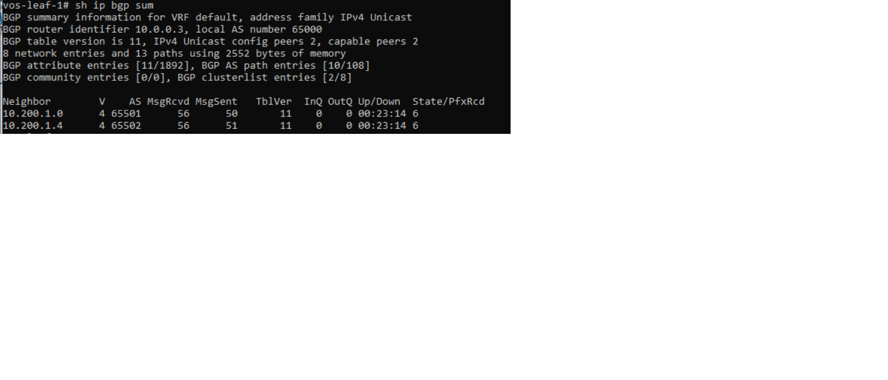
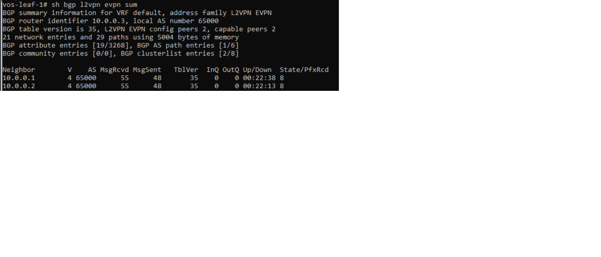
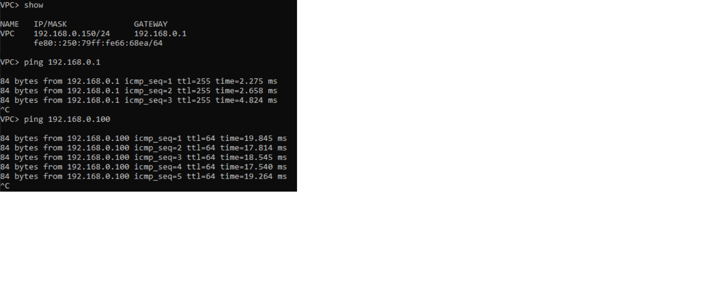
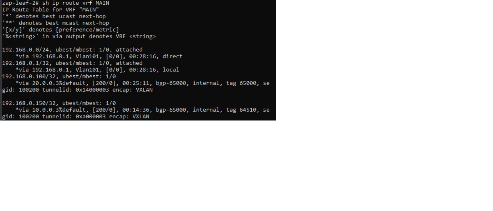

# Проектная работа на тему "Проектирование сети ЦОД с поддержкой L2 связанности"

### Введение <a name="Введение"></a> 
В данном проекте рассматривается построение фабрики EVPN VXLAN на оборудовании Cisco Nexus.

#### Задачи <a name="Задачи"></a> 
- настроить underlay
- настроить overlay
- подключить два сервера
- настроить между ними L2-связность


### Топология сети <a name="Топология_сети"></a> 
В данной работе планируется построение сети с двумя POD, каждый POD состоит из 2 SPINE, 2 LEAF коммутаторов. POD1 и POD2 соединены прямыми линками между SPINE. 
Ниже представлена структурная схема сети:

Фабрика будет состоять из следующих компонентов:
|Device|Role|Model|
|---|---|---|
vos-spine-1|spine|cisco nexus 9k
vos-spine-2|spine|cisco nexus 9k
vos-leaf-1|leaf|cisco nexus 9k
vos-leaf-2|leaf|cisco nexus 9k
zap-spine-1|spine|cisco nexus 9k
zap-spine-2|spine|cisco nexus 9k
zap-leaf-1|leaf|cisco nexus 9k
zap-leaf-2|leaf|cisco nexus 9k


### Адресация <a name="Адресация"></a>
**POD1**
|Network|Description|
|---|---|
||Loopbacks|
|10.0.0.1/32|loopback vos-spine-1
|10.0.0.2/32|loopback vos-spine-2
|10.0.0.3/32|loopback vos-leaf-1
|10.0.0.4/32|loopback vos-leaf-2
||P2P Spine-Leaf|
|10.200.1.0/31|vos-spine-1 < - > vos-leaf-1
|10.200.1.2/31|vos-spine-1 < - > vos-leaf-2
|10.200.1.4/31|vos-spine-2 < - > vos-leaf-1
|10.200.1.6/31|vos-spine-2 < - > vos-leaf-2

**POD2**
|Network|Description|
|---|---|
||Loopbacks|
|20.0.0.1/32|loopback zap-spine-1
|20.0.0.2/32|loopback zap-spine-2
|20.0.0.3/32|loopback zap-leaf-1
|20.0.0.4/32|loopback zap-leaf-2
||P2P Spine-Leaf|
|10.200.2.0/31|zap-spine-1 < - > zap-leaf-1
|10.200.2.2/31|zap-spine-1 < - > zap-leaf-2
|10.200.2.4/31|zap-spine-2 < - > zap-leaf-1
|10.200.2.6/31|zap-spine-2 < - > zap-leaf-2

**POD1 - POD2**
|Network|Description|
|---|---|
||P2P vos-spine < - > zap-spine|
|10.200.1.10/31| vos-spine-1 < - > zap-spine-1
|10.200.1.12/31| vos-spine-1 < - > zap-spine-2
|10.200.1.14/31| vos-spine-2 < - > zap-spine-1
|10.200.1.16/31| vos-spine-2 < - > zap-spine-2


### Используемые технологии <a name="Используемые_технологии"></a> 
Ниже перечислены технологии, используемые в данном проекте:
|Для чего|Технология|Комментарий|
|---|---|---|
underlay|iBGP|прост в настройке и администрировании
overlay|BGP vxlan evpn|


### Настройка <a name="Настройка"></a>
#### Настройка underlay
Для стыка между SPINE-LEAF выделены /31 P2P сети. Где первый адрес в сети - адрес для SPINE. Второй адрес - адрес для LEAF.
Пример:
+ **10.200.1.0/31 vos-spine-1 <--> vos-leaf-1**
    + 10.200.1.0 vos-spine-1
    + 10.200.1.1 vos-leaf-1
+ **10.200.1.2/31 vos-spine-2 <--> vos-leaf-1**
    + 10.200.1.2 vos-spine-2
    + 10.200.1.3 vos-leaf-1

**Настройка линков**
Настройка линков включает базовые команды: description, ip address, mtu
Пример настройки с vos-spine-1 (на всех остальных аналогично):
```
interface Ethernet1/1
  description vos-leaf-1
  mtu 9216
  no ip redirects
  ip address 10.200.1.0/31
  no shutdown

interface Ethernet1/2
  description vos-leaf-2
  mtu 9216
  no ip redirects
  ip address 10.200.1.2/31
  no shutdown

interface Ethernet1/3
  description zap-spine-1 [e1/3]
  mtu 9216
  no ip redirects
  ip address 10.200.1.10/31
  no shutdown

interface Ethernet1/4
  description zap-spine-2 [e1/4]
  mtu 9216
  no ip redirects
  ip address 10.200.1.12/31
  no shutdown
```
**Настройка loopback**
Настройка лупбека включает базовые команды: description, ip address
```
interface lo0
 ip address 10.0.0.1/32 
```

**Настройка маршрутизации underlay**

Перед настройкой необходимо включить все необходимые опции:
```
nv overlay evpn
feature bgp
feature nv overlay
```
В качестве underlay протокола будет использоваться iBGP внутри POD и eBGP для стыков между POD:
|Device|ASN|
|---|---|
|vos-spine-1| 65501
|vos-spine-2| 65502
|vos-leaf-1| 65503
|vos-leaf-2| 65504
|zap-spine-1| 65001
|zap-spine-2| 65002
|zap-leaf-1| 65003
|zap-leaf-2| 65003

На каждом оборудовании создадим prefix-list с сетями underlay. Затем привяжем его к route-map, который будет использовать при настройке eBGP-сессии.
Данная настройка необходима для защиты анонсирования маршрутов.
Конфигурация на всем оборудовании одинакова:
```
ip prefix-list eBGP-Loopback.in seq 5 permit 10.0.0.0/24 ge 32
ip prefix-list eBGP-Loopback.in seq 10 permit 20.0.0.0/24 ge 32
ip prefix-list eBGP-Loopback.out seq 5 permit 10.0.0.0/24 ge 32
ip prefix-list eBGP-Loopback.out seq 10 permit 20.0.0.0/24 ge 32
route-map eBGP-Connected permit 10
  match ip address prefix-list eBGP-Loopback.out
route-map eBGP-Loopback.in permit 10
  match ip address prefix-list eBGP-Loopback.in
route-map eBGP-Loopback.in deny 20
route-map eBGP-Loopback.out permit 10
  match ip address prefix-list eBGP-Loopback.out
route-map eBGP-Loopback.out deny 20
```


Пример настройки с vos-spine-1:
```
router bgp 65000
  router-id 10.0.0.1
  graceful-restart-helper
  bestpath as-path multipath-relax
  log-neighbor-changes
  address-family ipv4 unicast
    redistribute direct route-map eBGP-Connected
    maximum-paths 64
  template peer MultiPod-eBGP-IPv4-Unicast
    local-as 64510 no-prepend replace-as
    address-family ipv4 unicast
      send-community
      send-community extended
  template peer eBGP-IPv4-Unicast
    local-as 65501 no-prepend replace-as
    timers 30 90
    address-family ipv4 unicast
      route-map eBGP-Loopback.in in
      route-map eBGP-Loopback.out out
  template peer-session iBGP
    remote-as 65000
    update-source loopback0
  neighbor 10.200.1.1
    inherit peer eBGP-IPv4-Unicast
    remote-as 65503
    description vos-spine-1 
    no shutdown
  neighbor 10.200.1.3
    inherit peer eBGP-IPv4-Unicast
    remote-as 65504
    description vos-spine-2 
    no shutdown
  neighbor 10.200.1.11
    inherit peer MultiPod-eBGP-IPv4-Unicast
    remote-as 64520
  neighbor 10.200.1.13
    inherit peer MultiPod-eBGP-IPv4-Unicast
    remote-as 64520
```
Проверить поднятие сессии можно при помощи show ip bgp summary. Посмотрим как это выглядит на vos-leaf-1


#### Настройка overlay
Настроим overlay при помощи eBGP.


Пример настройки со vos-spine-1:
```
router bgp 65000
  address-family l2vpn evpn
    maximum-paths 64
    maximum-paths ibgp 64
    retain route-target all
    advertise-pip
    allow-vni-in-ethertag
  template peer MultiPod-eBGP-l2vpn-evpn
    local-as 64510 no-prepend replace-as
    update-source loopback0
    ebgp-multihop 20
    address-family l2vpn evpn
      send-community
      send-community extended
      route-map nh_unchanged out
  template peer iBGP-L2VPN-EVPN-Unicast
    inherit peer-session iBGP
    timers 30 90
    address-family l2vpn evpn
      send-community extended
  template peer iBGP-L2VPN-EVPN-Unicast-RR-Client
    inherit peer-session iBGP
    timers 30 90
    address-family l2vpn evpn
      send-community extended
      route-reflector-client
  template peer-session iBGP
    remote-as 65000
    update-source loopback0
  neighbor 10.0.0.2
    inherit peer iBGP-L2VPN-EVPN-Unicast
    description vos-spine-2
  neighbor 10.0.0.3
    inherit peer iBGP-L2VPN-EVPN-Unicast-RR-Client
    description vos-leaf-1
  neighbor 10.0.0.4
    inherit peer iBGP-L2VPN-EVPN-Unicast-RR-Client
    description vos-leaf-2
    no shutdown
  neighbor 20.0.0.1
    inherit peer MultiPod-eBGP-l2vpn-evpn
    remote-as 64520
    no shutdown
  neighbor 20.0.0.2
    inherit peer MultiPod-eBGP-l2vpn-evpn
    remote-as 64520
    no shutdown

```
Проверить поднятие сессии можно при помощи show bgp l2vpn evpn summary. Посмотрим так же на vos-leaf-1:



#### Настройка VXLAN
Включаем поддержку VXLAN,L3, привязку vni к номеру vlan:
```
nv overlay evpn
feature interface-vlan
feature vn-segment-vlan-based
feature nv overlay
```
Задаем virtual mac для создания распределенного шлюза между всеми коммутаторами
```
fabric forwarding anycast-gateway-mac 0001.0001.0001
```
Создаём vlan и ассоциируем его с vni 10101
```
vlan 101
  name L2-VNI
  vn-segment 10101
```

Настроим интерфейс NVE, который отвечает за работу VxLAN. Сразу добавляем к int nve1 наш vni 10101, указываем , что для распределения bum трафика будет использоваться протокол bgp
```
interface nve1
  no shutdown
  host-reachability protocol bgp
  source-interface loopback0
  member vni 10101
    suppress-arp
    ingress-replication protocol bgp    
```
Можно проверить с какими пирами построились туннели и их состояние 


Настраиваем evpn route type-2, вручную задаём route-target 
```
router bgp 65000
evpn
  vni 10101 l2
    rd auto
    route-target import 10101:10101
    route-target export 10101:10101

```

#### Настройка портов в сторону серверов
```
interface Ethernet1/2
  description SRV2
  switchport
  switchport access vlan 101
  no shutdown
```
#### Создаём VRF (L3VNI)

Создаем сам VRF и вручную назначаем RT
```
vrf context MAIN
  vni 100200
  rd auto
  address-family ipv4 unicast
    route-target import 12:100200
    route-target import 12:100200 evpn
    route-target export 12:100200
    route-target export 12:100200 evpn

Создаем VLAN и SVI для L3 VNI
vlan 10
  name L3-VNI-MAIN
  vn-segment 100200

interface Vlan10
  description L3-VNI-MAIN
  no shutdown
  vrf member MAIN
  no ip redirects
  ip forward

Ассоциируем VNI с VRF
interface nve1
  member vni 100200 associate-vrf
```
Создаём шлюз для сети 192.168.0.0/24 на svi
```
interface Vlan101
  description SRV
  no shutdown
  vrf member MAIN
  ip address 192.168.0.1/24
  fabric forwarding mode anycast-gateway
  ```
  IP адреса на конечных хостах:
  ```
  POD1 SRV1:192.168.0.150/24
  POD2 SRV2:192.168.0.100/24
  ```
#### Выполняем проверки связности
SRV1 пингует шлюз и пингует SRV2



Проверяем маршруты на leaf




Проверяем таблицу мак адресов на лифах разных POD. Видим, что маки конечных устройств видны с обеих сторон


### Итог
Рассмотрели и настроили с примерами построение EVPN VXLAN с использованием двух POD на оборудовании cisco nexus
